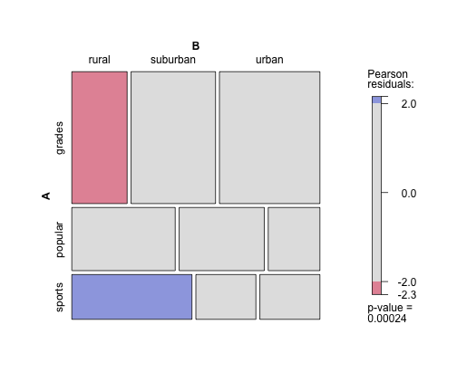
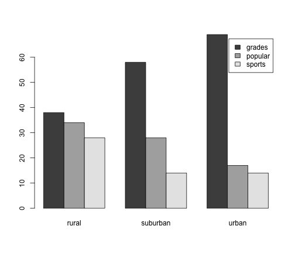

Example for categorical data analysis: two-way contingency tables
===================================================
M. Huebner 2014-03-24
---------------------------------------------------

Students in grades 4-6 were asked whether good grades, athletic ability, or popularity was most important to them. The responses were divided by school area into urban, suburban, and rural. Is there an association between the type of school area and the students' choice of good grades, athletic ability, or popularity as most important?  

*Reference: Chase, M.A and Dummer, G.M. (1992), "The Role of Sports as a Social Determinant for Children," Research Quarterly for Exercise and Sport, 63, 418-424. Dataset available through the Statlib Data and Story Library (DASL).*


```r
grades <- c(38, 58, 69)
popular <- c(34, 28, 17)
sports <- c(28, 14, 14)
kids <- rbind(grades, popular, sports)
colnames(kids) <- c("rural", "suburban", "urban")
```


Adding row and column sums:

```r
addmargins(kids)
```

```
##         rural suburban urban Sum
## grades     38       58    69 165
## popular    34       28    17  79
## sports     28       14    14  56
## Sum       100      100   100 300
```


Adding row and column sums, calculating proportions

```r
addmargins(kids)
```

```
##         rural suburban urban Sum
## grades     38       58    69 165
## popular    34       28    17  79
## sports     28       14    14  56
## Sum       100      100   100 300
```

```r
prop.table(kids)  # cell proportion= cell count/total
```

```
##           rural suburban   urban
## grades  0.12667  0.19333 0.23000
## popular 0.11333  0.09333 0.05667
## sports  0.09333  0.04667 0.04667
```

```r
apply(prop.table(kids), 1, sum)  # row proportions
```

```
##  grades popular  sports 
##  0.5500  0.2633  0.1867
```

```r
apply(prop.table(kids), 2, sum)  # column proportions
```

```
##    rural suburban    urban 
##   0.3333   0.3333   0.3333
```


Performing a test of independence of the two categories school area and important aspects:

```r
fit <- chisq.test(kids)
fit
```

```
## 
## 	Pearson's Chi-squared test
## 
## data:  kids
## X-squared = 21.63, df = 4, p-value = 0.0002377
```


Full information for each cell of observed, expected, and residuals

```r
fit$observed
```

```
##         rural suburban urban
## grades     38       58    69
## popular    34       28    17
## sports     28       14    14
```

```r
fit$expected
```

```
##         rural suburban urban
## grades  55.00    55.00 55.00
## popular 26.33    26.33 26.33
## sports  18.67    18.67 18.67
```

```r
fit$residuals
```

```
##          rural suburban  urban
## grades  -2.292   0.4045  1.888
## popular  1.494   0.3248 -1.819
## sports   2.160  -1.0801 -1.080
```


Contribution of each cell to the test statistic:

```r
(fit$observed - fit$expected)^2/fit$expected
```

```
##         rural suburban urban
## grades  5.255   0.1636 3.564
## popular 2.232   0.1055 3.308
## sports  4.667   1.1667 1.167
```


Visualization of a two-way contingency table:


```r
library(vcd)
```

```
## Loading required package: grid
```

```r
mosaic(kids, shade = TRUE, legend = TRUE)
```

 

```r
barplot(kids, beside = T, legend = T)
```

 

```r

# if column sums do not add up to 100 as in the example, the following will
# produce such barplots x<-prop.table(kids,2) barplot(x, beside=T, legend=T)
```


### Results: For 4-6 graders the importance of grades, popularity, athletic ability seems to be associated with the type of school area (urban, suburban, or rural). In particular, grades seem to be less important than expected in a rural school and athletic ability more important than expected in a rural school. The side-by-side barplots seem to indicate that grades become increasingly important for more urban type school areas.
