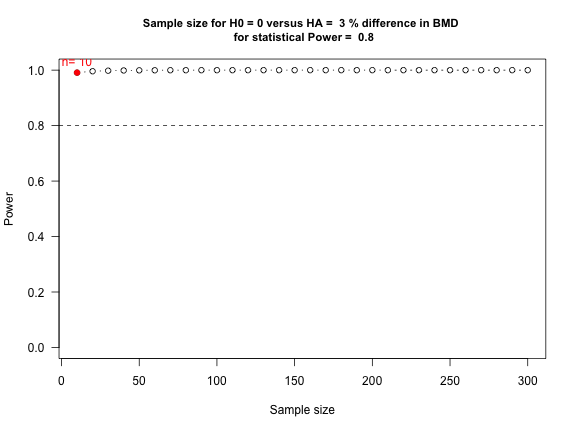

Power and sample size calculation for a hypothesis test for the mean
========================================================
M. Huebner 2014-03-14
-------------------------------------------------------

The impact of habitual physical activity was studied for 25 year old women in Malmo, Sweden (PEAK-25 Study).
Women were contacted through administrative databases, excluding women who were currently pregnant or within 12 months prior. Bone mineral density was measured at the trochanter, femoral neck, and lumbar spine. The women filled out questionnaires about the type and regularity of activities. In the example below data from the peak strain score (PSS) that graded activity by weight bearing, such as jumping or turning, were used. The grades were added for all activities, and a level of PSS $\ge 5$ was classified as high impact. Of particular interest was the comparison of the group of women with high impact versus low or moderate impact.

Reference: Callreus M, McGuigan F, Ringsberg K, Akesson K.  Self-reported recreational exercise combining regularity and impact is  necessary to maximize bone mineral density in young adult women. Osteoporosis Int 2012.  23:2517-2526


#### The purpose of this document is the calculation of power and sample sizes to be able to be able to detect the effect of exercise  in bone mineral density (BMD). This is expressed as % change in BMD between the high impact exercise group and others.

The low or moderate impact group had BMD at the trochanter of 0.823 grams per square centimeter.
The null hypothesis is "There is no change in BMD for the high impact exercise group." The alternative hypothesis is "There is a positive change in BMD for the high impact group." The mean difference in measures as percent change from 0.823, so this is a hypothesis test for the mean.

*Note: Statistical analyses would consider adjusting for smoking, alcohol assumption, or body amss index. For our purposes we define the baseline to be 0.823 nd consider the change in the high impact exercise group and do not consider adjustment factors.*
 
$$
\begin{aligned}
H_0: && \mu = 0 \\
H_1: && \mu > 0
\end{aligned}
$$


The probability of a type I error is P(type I) = $P(T > t_{\alpha/2, n-1} | \mu =0) = \alpha$.
The probability of a type II error is P(type II error) = $P(T > t_{\alpha/2, n-1} | \mu =\mu_1)$, and the statistical power is 1-P(type II error). For the power and type II error we assume that $H_1$ is true, hence the mean from $H_1$ must be assumed to be known. 

***********

The formula for the statistical power consists of four quantities:  
1. sample size  
2. significance level  
3. effect size  
4. power  
If three of the four quantities are known, then the fourth can be calculated.

************

### How many women are needed to detect a difference in bone mineral density of 3 % at the significance level 0.05 with 80% power?

We have one sample, namely the high impact exercise group, and compare their BMD to the reference of 0.823 BMD in the low to moderate exercise group. 


```r
alpha = 0.05
d = 0.03  # difference in means
s = 0.153  # standard deviation
bmd <- power.t.test(power = 0.8, delta = d, sd = s, sig.level = alpha, type = "one.sample")
bmd
```

```
## 
##      One-sample t test power calculation 
## 
##               n = 206.1
##           delta = 0.03
##              sd = 0.153
##       sig.level = 0.05
##           power = 0.8
##     alternative = two.sided
```


This requires a sample size of 207 women in the high impact exercise group.


### If there is a fixed sample size of n=250, what % change in bone mineral density could be detected at the significance level 0.05 with 80% power?


```r
alpha = 0.05
s = 0.153  # standard deviation
bmd <- power.t.test(power = 0.8, n = 250, sd = s, sig.level = alpha, type = "one.sample")
bmd
```

```
## 
##      One-sample t test power calculation 
## 
##               n = 250
##           delta = 0.0272
##              sd = 0.153
##       sig.level = 0.05
##           power = 0.8
##     alternative = two.sided
```


This requires  a change in BMD of 2.7 %.


****************

### We can also calculate the power for varying sample size and draw a curve.

Setting the parameters and creating a sequence of sample sizes:

```r
alpha = 0.05
s = 0.153
mu1 = 0.03  # 3 % difference in BMD between the two groups
pow = 0.8  # desired power of the study
n = seq(from = 10, to = 300, by = 10)
```


Initiating the vectors:


```r
margin <- rep(0, length(n))
delta <- rep(0, length(n))
power.t <- rep(0, length(n))
```


Calculating the power for these settings:

```r
for (i in 1:length(n)) {
    margin[i] <- (-qt(p = alpha/2, df = n[i] - 1)) * s/sqrt(n[i])
    delta[i] <- (margin[i] - mu1)/(s/sqrt(n[i]))
    power.t[i] <- 1 - pt(delta[i], df = n[i] - 1)
}
```


Find the smallest sample size yielding at least the required power:

```r
sampsize <- min(which(power.t > pow))
```


Get and print the required sample size to reject the null given the effect size:

```r
result <- paste("n=", n[sampsize])
```


Plot it all.

```r
plot(n, power.t, type = "b", las = 1, ylim = c(0, 1), ylab = "Power", xlab = "Sample size")

title(paste("Sample size for H0 =", 0, "versus HA = ", 100 * mu1, "% difference in BMD", 
    "\n", "for statistical Power = ", pow), cex.main = 0.95)

points(n[sampsize], power.t[sampsize], col = "red", pch = 19)
text(n[sampsize], power.t[sampsize], col = "red", label = result, pos = 3)
abline(h = pow, lty = "dashed")
```

 


