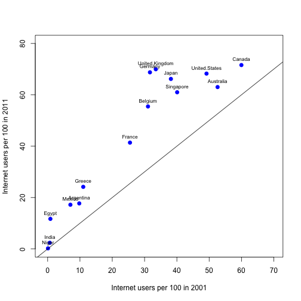

Example of a linear regression analysis: 
==============================================
Association of boiling point and pressure
==============================================
M. Huebner 2014-03-24
----------------------------------------------


 In the 1840s and 1850s a Scottish physicist, James D. Forbes, wanted to be able to estimate 
 altitude above sea level from measurement of the boiling point of the water. 
 He studied the relationship between boiling point and pressure. Forbes’ theory suggested 
 that over the range of observed values the graph of boiling point versus the logarithm of 
 pressure yields a straight line. Since the logs of the pressures do not vary much, all 
 values of log(press) are multiplied by 100. This avoids studying very small numbers, 
 without changing the major features of the analysis.   
 *Reference: S. Weisberg. Applied Linear Regression. Wiley 2005.*


```r
# load the data and attcah the dataset
library(MASS)
data(forbes)

# Transform the pressure to 100*log(presure) useing a base 10 logarithm
forbes$hlpr <- 100 * log10(forbes$pres)
forbes$boil <- forbes$bp
```


Create a scatter plot of the predictor versus the response. 


```r
plot(hlpr ~ pres, data = forbes)
```

 

**This looks like a reasonable linear relationship.**


Create summary statistics and calculate the correlation coefficient

```r
summary(forbes$boil)
```

```
##    Min. 1st Qu.  Median    Mean 3rd Qu.    Max. 
##     194     199     201     203     209     212
```

```r
summary(forbes$hlpr)
```

```
##    Min. 1st Qu.  Median    Mean 3rd Qu.    Max. 
##     132     136     138     140     144     148
```

```r
cor(forbes$boil, forbes$hlpr)
```

```
## [1] 0.9975
```


Fit a linear regression model and look at the regression output

```r
fit <- lm(hlpr ~ boil, data = forbes)
summary(fit)
```

```
## 
## Call:
## lm(formula = hlpr ~ boil, data = forbes)
## 
## Residuals:
##     Min      1Q  Median      3Q     Max 
## -0.3197 -0.1471 -0.0689  0.0188  1.3599 
## 
## Coefficients:
##             Estimate Std. Error t value Pr(>|t|)    
## (Intercept) -42.1642     3.3414   -12.6  2.2e-09 ***
## boil          0.8956     0.0165    54.4  < 2e-16 ***
## ---
## Signif. codes:  0 '***' 0.001 '**' 0.01 '*' 0.05 '.' 0.1 ' ' 1
## 
## Residual standard error: 0.379 on 15 degrees of freedom
## Multiple R-squared:  0.995,	Adjusted R-squared:  0.995 
## F-statistic: 2.96e+03 on 1 and 15 DF,  p-value: <2e-16
```

**The boiling point is a sigificant predictor for 100 log(pressure).**

Draw a scatter plot with the regression line.

```r
plot(hlpr ~ pres, data = forbes)
abline(fit)
```

 


Regression coefficients: this is the slope

```r
fit$coefficients[2]
```

```
##   boil 
## 0.8956
```

Note that the estimated regression line is `hlpr=fit$coefficients[1]+fit$coefficients[2]*boil` namely  hlpr= -42.1642 + 0.8956 boil.

R square and adjusted R square indicate how much variation of the response (hlpr) is explained by regression on the boiling point.


```r
summary(fit)$r.squared
```

```
## [1] 0.995
```

```r
summary(fit)$adj.r.squared
```

```
## [1] 0.9946
```


How scattered are the points around the line?

```r
summary(fit)$sigma
```

```
## [1] 0.3792
```


Calculate a 95% CI for the slope

```r
tble <- summary(fit)$coefficients
slope.mean <- tble[2, 1]
slope.se <- tble[2, 2]
df <- fit$df.residual
critval <- abs(qt(0.025, df))

CIlow <- slope.mean - critval * slope.se
CIup <- slope.mean + critval * slope.se
```

A 95% CI for the slope is (0.8605, 0.9307).

Is the boiling point statistically significantly associated with HLPR?


```r
pval <- tble[2, 4]
```

**The p value for testing $H_0: \beta = 0$ vs $H_1: \beta \ne 0$ is 1.1898 &times; 10<sup>-18</sup>.**


### Diagnostics and Residual Analysis


Is there evidence that the residuals do not follow a normal distribution?

```r
qqnorm(fit$residuals)
qqline(fit$residuals)
```

 

**It appears there is one outlier.**

Make a residual plot.

```r
fit.stdres = rstandard(fit)
plot(fit$fitted, fit.stdres, xlab = "Fitted values", ylab = "Standardized residuals")
abline(h = 0, col = 2, lwd = 2)
```

 

You can identify the point with the largest residual by using `identify(fit$fitted, fit.stdres)` click on the point in questions and then click Esc. This will identify the point as record number 12 in the dataset.


In the presence of outliers, it is useful to do the anlaysis with and without the point.
Remove large residuals.

```r
indx <- which(fit.stdres > 2)
forbes1 <- forbes[-indx, ]
```


Redo regression analysis with this outlier removed

```r
fit1 <- lm(hlpr ~ boil, data = forbes1)
summary(fit1)
```

```
## 
## Call:
## lm(formula = hlpr ~ boil, data = forbes1)
## 
## Residuals:
##     Min      1Q  Median      3Q     Max 
## -0.2088 -0.0634  0.0197  0.0884  0.1356 
## 
## Coefficients:
##              Estimate Std. Error t value Pr(>|t|)    
## (Intercept) -41.33468    1.00331   -41.2  5.2e-16 ***
## boil          0.89111    0.00494   180.2  < 2e-16 ***
## ---
## Signif. codes:  0 '***' 0.001 '**' 0.01 '*' 0.05 '.' 0.1 ' ' 1
## 
## Residual standard error: 0.114 on 14 degrees of freedom
## Multiple R-squared:     1,	Adjusted R-squared:     1 
## F-statistic: 3.25e+04 on 1 and 14 DF,  p-value: <2e-16
```

**The regression fit and coefficient of determination did not change much.**


```r
fit.stdres = rstandard(fit1)
plot(fit1$fitted, fit.stdres, xlab = "Fitted values", ylab = "Standardized residuals")
abline(h = 0, col = 2, lwd = 2)
```

 

**There are no obvious outliers in this plot after the point was removed.**

