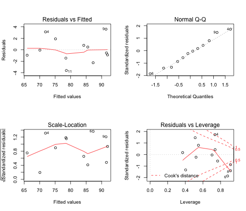

Visualizing association between two quantitative variables
==============================================================
M. Huebner 2014-03-28
-------------------------------------------------------------

Load crime data from 50 states.

```r
data(USArrests)
crime <- USArrests
```

To check what information is available in the dataset you an type `?USArrests`. 
The data set contains
* Murder arrests per 100,000
* Assault arrests per 100,000
* Percent urban population
* Rape arrests per 100,000

Make a scatter plot of % urban population versus number of murder arrests. The ranges of the x-axis and y-axis are chosen automatically, or can be defined with xlim and ylim.


```r
plot(Murder ~ UrbanPop, data = crime, xlim = c(15, 100), ylim = c(0, 20), pch = 19, 
    col = "blue")
# label the points with the state
with(crime, text(Murder ~ UrbanPop, labels = row.names(crime), pos = 4, cex = 0.5))
```

 


Which states have higher arrests for murder and assault?

```r
plot(Murder ~ Assault, data = crime, xlim = c(40, 400), ylim = c(0, 20), xlab = "Assault per 100,000", 
    ylab = "Murder per 100,000")
with(crime, text(Murder ~ Assault, labels = row.names(crime), pos = 4, cex = 0.5))
```

 


What is it in Michigan?

```r
crime$state <- rownames(crime)
crime[crime$state == "Michigan", ]
```

```
##          Murder Assault UrbanPop Rape    state
## Michigan   12.1     255       74 35.1 Michigan
```


```r
# Label Michigan in the figure
plot(Murder ~ Assault, data = crime, xlim = c(40, 400), ylim = c(0, 20), xlab = "Assault per 100,000", 
    ylab = "Murder per 100,000")
with(crime, text(Murder ~ Assault, labels = row.names(crime), pos = 4, cex = 0.5))
indx <- which(crime$state == "Michigan")
points(crime$Assault[indx], crime$Murder[indx], pch = 19, col = "red")
```

 


## Machine learning: principle component analysis (PCA)

```r
apply(USArrests, 2, mean)
```

```
##   Murder  Assault UrbanPop     Rape 
##    7.788  170.760   65.540   21.232
```

```r
apply(USArrests, 2, var)
```

```
##   Murder  Assault UrbanPop     Rape 
##    18.97  6945.17   209.52    87.73
```

A variable with larger variance, such as Assault, would dominate the principal components.  So  variables should be standardized before PCA. This step is built-in for the following function.


```r
pca.out = prcomp(USArrests, scale = TRUE)
pca.out
```

```
## Standard deviations:
## [1] 1.5749 0.9949 0.5971 0.4164
## 
## Rotation:
##              PC1     PC2     PC3      PC4
## Murder   -0.5359  0.4182 -0.3412  0.64923
## Assault  -0.5832  0.1880 -0.2681 -0.74341
## UrbanPop -0.2782 -0.8728 -0.3780  0.13388
## Rape     -0.5434 -0.1673  0.8178  0.08902
```

```r
biplot(pca.out, scale = 0, cex = 0.6)
```

 


### The states with larger crime rates are towards the left.  States with larger proportion of urban population are towards the bottom.


