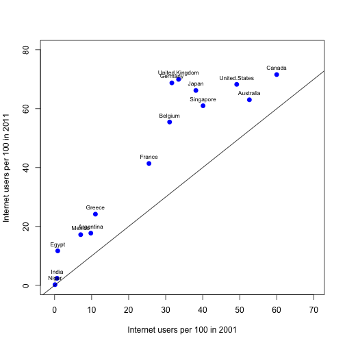
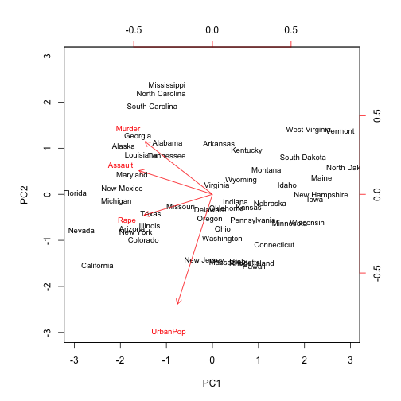
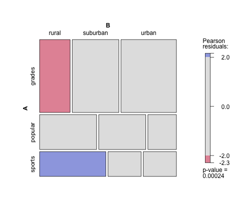

 Rcode for inference for comparing means (t-interval or t-test)
===============================================================================

Internet users per 100 people downloaded from GAPMINDER (http://www.gapminder.org/data/)
subset of 15 countries


```r
ituse <- read.csv("internetusers.csv", header = TRUE)
```


There are 15 countries in 2001 and 2011.


```r
countries <- c("Argentina", "Australia", "Belgium", "Canada", "Egypt", "France", 
    "Germany", "Greece", "India", "Japan", "Mexico", "Niger", "Singapore", "United.Kingdom", 
    "United.States")
Y2011 <- c(17.72058337, 63.02693628, 55.47689608, 71.59660113, 11.69839821, 
    41.39108117, 68.76941828, 24.17107186, 2.388075, 66.19826223, 17.21, 0.221341351, 
    61.00284566, 69.9749171, 68.26789985)
Y2001 <- c(9.780807285, 52.60563888, 31.05933918, 59.97791664, 0.838945611, 
    25.48284606, 31.66413443, 11.0173514, 0.660146377, 38.15162324, 7.038023117, 
    0.105185431, 40.08896306, 33.47495977, 49.18000685)
```


Is there a sigificant change in internet users from 2001 to 2011 in these countries?


```r
t.test(Y2001, Y2011, paired = TRUE)
```

```
## 
## 	Paired t-test
## 
## data:  Y2001 and Y2011
## t = -5.726, df = 14, p-value = 5.244e-05
## alternative hypothesis: true difference in means is not equal to 0
## 95 percent confidence interval:
##  -22.73 -10.34
## sample estimates:
## mean of the differences 
##                  -16.53
```


or testing independent samples of no change versus the alternative hypothesis 
that in 2001 were fewer internet users.


```r
t.test(Y2001, Y2011, alternative = "less")
```

```
## 
## 	Welch Two Sample t-test
## 
## data:  Y2001 and Y2011
## t = -1.892, df = 25.76, p-value = 0.0349
## alternative hypothesis: true difference in means is less than 0
## 95 percent confidence interval:
##    -Inf -1.622
## sample estimates:
## mean of x mean of y 
##     26.08     42.61
```


Look at the data. Which countries changed the most?


```r
plot(Y2001, Y2011, xlab = "Internet users per 100 in 2001", ylab = "Internet users per 100 in 2011", 
    xlim = c(-1, 70), ylim = c(0, 80), col = "blue", pch = 19, cex = 1, lty = "solid", 
    lwd = 2)
text(Y2001, Y2011, labels = countries, cex = 0.7, pos = 3)
abline(a = 0, b = 1)
```

 


Optional: look at internet use over time for some countries


```r
plot(1990:2011, ituse[, c("United.States")], type = "l", lty = 1, col = 1, xlab = "year", 
    ylab = "internet users per 100", ylim = c(0, 90))
lines(1990:2011, ituse[, c("Germany")], type = "l", lty = 1, col = 2)
lines(1990:2011, ituse[, c("Canada")], type = "l", lty = 1, col = 3)
lines(1990:2011, ituse[, c("Japan")], type = "l", lty = 1, col = 4)
lines(1990:2011, ituse[, c("France")], type = "l", lty = 1, col = 5)
lines(1990:2011, ituse[, c("Greece")], type = "l", lty = 1, col = 6)
legend("topleft", legend = c("United.States", "Germany", "Canada", "Japan", 
    "France", "Greece"), lty = 1, col = 1:6, cex = 0.7)
```

 


Check whether the data follow a t-distribution


```r
qqplot(qt(ppoints(15), df = 14), Y2001, main = expression("Q-Q plot for" ~ ~{
    t
}[df == 14]))
```

 

```r
qqplot(qt(ppoints(15), df = 14), Y2011, main = expression("Q-Q plot for" ~ ~{
    t
}[df == 14]))
```

 


or a normal distribution


```r
qqnorm(Y2001)
qqline(Y2001)
```

 

```r
qqnorm(Y2011)
qqline(Y2011)
```

 


There is a question whether the 2011 internet usage data follow a symmetric distribution 
for the selected countries. 
