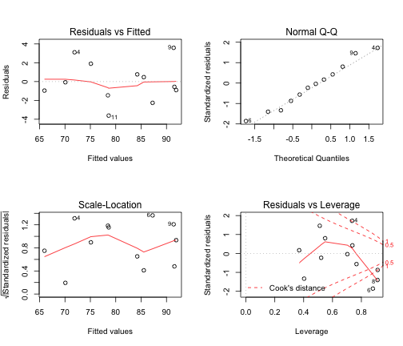

Multiple regression: Baseball
========================================================

In many regression models the response variable $y$ may be related to more than one explanatory variable. The predictors $x_1, \dots x_k$ that have a significant effect can be incorporated in the model
$$
y=\beta_0 + \beta_1 x_1 +\dots + \beta_p x_p + \varepsilon
$$
To predict the number of wins for a professional baseball team data for the following variables were collected: *batavg= batting average, rbi=runs batted in, stole= number of stolen bases, strkout=number of struck out, era=earned run average, caught=number caught stealing bases, errors=number of errors.*


```r
wins1 <- read.csv("baseball_wins.csv", header = T)
wins2 <- read.csv("BaseballStats_2005v2.csv", header = T)
```


Regression analysis with all predictors:

```r
fit <- lm(wins ~ batavg + rbi + stole + strkout + caught + error + era, wins1)
summary(fit)
```

```
## 
## Call:
## lm(formula = wins ~ batavg + rbi + stole + strkout + caught + 
##     error + era, data = wins1)
## 
## Residuals:
##       1       2       3       4       5       6       7       8       9 
## -0.9561  1.8956 -0.5596  3.1112  0.4711 -2.2610 -0.9044 -1.4607  3.5854 
##      10      11      12 
## -0.0718 -3.6154  0.7656 
## 
## Coefficients:
##             Estimate Std. Error t value Pr(>|t|)  
## (Intercept) -39.3720   137.2629   -0.29    0.788  
## batavg      341.6153   391.2135    0.87    0.432  
## rbi           0.0717     0.0439    1.63    0.178  
## stole         0.0815     0.1177    0.69    0.527  
## strkout       0.0647     0.0674    0.96    0.391  
## caught       -0.2697     0.3454   -0.78    0.479  
## error        -0.0917     0.1225   -0.75    0.496  
## era         -15.1138     4.3941   -3.44    0.026 *
## ---
## Signif. codes:  0 '***' 0.001 '**' 0.01 '*' 0.05 '.' 0.1 ' ' 1
## 
## Residual standard error: 3.51 on 4 degrees of freedom
## Multiple R-squared:  0.947,	Adjusted R-squared:  0.855 
## F-statistic: 10.3 on 7 and 4 DF,  p-value: 0.0201
```

What are the three variables with the most significant pvalues?


```r
sort(summary(fit)$coefficients[, 4])[1:3]
```

```
##     era     rbi strkout 
##  0.0263  0.1781  0.3913
```


Simple linear regression analysis with the two most significant predictors:

```r
fit1 <- lm(wins ~ era, wins1)
summary(fit1)
```

```
## 
## Call:
## lm(formula = wins ~ era, data = wins1)
## 
## Residuals:
##    Min     1Q Median     3Q    Max 
##  -9.77  -4.28   1.93   4.24   8.69 
## 
## Coefficients:
##             Estimate Std. Error t value Pr(>|t|)    
## (Intercept)   143.50      19.40    7.40  2.3e-05 ***
## era           -16.47       5.09   -3.24   0.0089 ** 
## ---
## Signif. codes:  0 '***' 0.001 '**' 0.01 '*' 0.05 '.' 0.1 ' ' 1
## 
## Residual standard error: 6.75 on 10 degrees of freedom
## Multiple R-squared:  0.512,	Adjusted R-squared:  0.463 
## F-statistic: 10.5 on 1 and 10 DF,  p-value: 0.00889
```

```r
fit2 <- lm(wins ~ rbi, wins1)
summary(fit2)
```

```
## 
## Call:
## lm(formula = wins ~ rbi, data = wins1)
## 
## Residuals:
##     Min      1Q  Median      3Q     Max 
## -15.839  -2.785  -0.501   5.474   9.303 
## 
## Coefficients:
##             Estimate Std. Error t value Pr(>|t|)  
## (Intercept)  12.6891    25.5211    0.50    0.630  
## rbi           0.1072     0.0399    2.69    0.023 *
## ---
## Signif. codes:  0 '***' 0.001 '**' 0.01 '*' 0.05 '.' 0.1 ' ' 1
## 
## Residual standard error: 7.37 on 10 degrees of freedom
## Multiple R-squared:  0.419,	Adjusted R-squared:  0.361 
## F-statistic: 7.21 on 1 and 10 DF,  p-value: 0.0229
```

 The R-squared value for all seven predictors is 0.8548 while the R-squared for *era* is  0.4631 and for *rbi* 0.361.
 
A model with the these two variables is


```r
fit3 <- lm(wins ~ era + rbi, wins1)
summary(fit3)
```

```
## 
## Call:
## lm(formula = wins ~ era + rbi, data = wins1)
## 
## Residuals:
##    Min     1Q Median     3Q    Max 
## -6.828 -2.313  0.913  2.760  4.119 
## 
## Coefficients:
##             Estimate Std. Error t value Pr(>|t|)    
## (Intercept)  76.9433    18.5424    4.15  0.00249 ** 
## era         -15.1963     2.9749   -5.11  0.00064 ***
## rbi           0.0968     0.0214    4.53  0.00143 ** 
## ---
## Signif. codes:  0 '***' 0.001 '**' 0.01 '*' 0.05 '.' 0.1 ' ' 1
## 
## Residual standard error: 3.93 on 9 degrees of freedom
## Multiple R-squared:  0.851,	Adjusted R-squared:  0.818 
## F-statistic: 25.7 on 2 and 9 DF,  p-value: 0.00019
```

This has R-squared value 0.8179.

Is it possible to find a third variable, which together with *era* and *rbi*, improves R-squared?


```r
fitx <- lm(wins ~ era + rbi + batavg, wins1)
summary(fitx)
```

```
## 
## Call:
## lm(formula = wins ~ era + rbi + batavg, data = wins1)
## 
## Residuals:
##    Min     1Q Median     3Q    Max 
##  -7.21  -2.21   1.20   2.28   3.51 
## 
## Coefficients:
##             Estimate Std. Error t value Pr(>|t|)    
## (Intercept)  19.5268    48.0912    0.41  0.69536    
## era         -15.4976     2.8818   -5.38  0.00066 ***
## rbi           0.0773     0.0256    3.02  0.01664 *  
## batavg      276.8973   215.2556    1.29  0.23429    
## ---
## Signif. codes:  0 '***' 0.001 '**' 0.01 '*' 0.05 '.' 0.1 ' ' 1
## 
## Residual standard error: 3.8 on 8 degrees of freedom
## Multiple R-squared:  0.877,	Adjusted R-squared:  0.83 
## F-statistic: 18.9 on 3 and 8 DF,  p-value: 0.000542
```

```r
fitx <- lm(wins ~ era + rbi + stole, wins1)
summary(fitx)
```

```
## 
## Call:
## lm(formula = wins ~ era + rbi + stole, data = wins1)
## 
## Residuals:
##    Min     1Q Median     3Q    Max 
##  -6.22  -2.87   1.32   2.79   4.12 
## 
## Coefficients:
##             Estimate Std. Error t value Pr(>|t|)  
## (Intercept)  57.7386    37.9862    1.52     0.17  
## era         -13.6397     4.0730   -3.35     0.01 *
## rbi           0.1114     0.0333    3.34     0.01 *
## stole         0.0270     0.0461    0.59     0.57  
## ---
## Signif. codes:  0 '***' 0.001 '**' 0.01 '*' 0.05 '.' 0.1 ' ' 1
## 
## Residual standard error: 4.08 on 8 degrees of freedom
## Multiple R-squared:  0.857,	Adjusted R-squared:  0.804 
## F-statistic:   16 on 3 and 8 DF,  p-value: 0.000964
```

```r
fitx <- lm(wins ~ era + rbi + strkout, wins1)
summary(fitx)
```

```
## 
## Call:
## lm(formula = wins ~ era + rbi + strkout, data = wins1)
## 
## Residuals:
##    Min     1Q Median     3Q    Max 
## -6.515 -1.563  0.528  2.792  3.839 
## 
## Coefficients:
##             Estimate Std. Error t value Pr(>|t|)   
## (Intercept)  65.8165    29.3637    2.24   0.0553 . 
## era         -15.2959     3.1127   -4.91   0.0012 **
## rbi           0.0995     0.0230    4.33   0.0025 **
## strkout       0.0105     0.0209    0.50   0.6278   
## ---
## Signif. codes:  0 '***' 0.001 '**' 0.01 '*' 0.05 '.' 0.1 ' ' 1
## 
## Residual standard error: 4.11 on 8 degrees of freedom
## Multiple R-squared:  0.856,	Adjusted R-squared:  0.801 
## F-statistic: 15.8 on 3 and 8 DF,  p-value: 0.00101
```

```r
fitx <- lm(wins ~ era + rbi + caught, wins1)
summary(fitx)
```

```
## 
## Call:
## lm(formula = wins ~ era + rbi + caught, data = wins1)
## 
## Residuals:
##    Min     1Q Median     3Q    Max 
## -6.547 -2.254  0.767  3.095  3.614 
## 
## Coefficients:
##             Estimate Std. Error t value Pr(>|t|)   
## (Intercept)  63.7529    33.6335    1.90   0.0946 . 
## era         -14.3226     3.6043   -3.97   0.0041 **
## rbi           0.1078     0.0319    3.38   0.0097 **
## caught        0.0479     0.0999    0.48   0.6441   
## ---
## Signif. codes:  0 '***' 0.001 '**' 0.01 '*' 0.05 '.' 0.1 ' ' 1
## 
## Residual standard error: 4.11 on 8 degrees of freedom
## Multiple R-squared:  0.855,	Adjusted R-squared:  0.801 
## F-statistic: 15.7 on 3 and 8 DF,  p-value: 0.00102
```

```r
fitx <- lm(wins ~ era + rbi + error, wins1)
summary(fitx)
```

```
## 
## Call:
## lm(formula = wins ~ era + rbi + error, data = wins1)
## 
## Residuals:
##    Min     1Q Median     3Q    Max 
## -3.880 -1.288 -0.175  1.431  4.985 
## 
## Coefficients:
##             Estimate Std. Error t value Pr(>|t|)    
## (Intercept)  89.8536    13.8388    6.49  0.00019 ***
## era         -12.6606     2.2692   -5.58  0.00052 ***
## rbi           0.0973     0.0152    6.39  0.00021 ***
## error        -0.1808     0.0579   -3.12  0.01420 *  
## ---
## Signif. codes:  0 '***' 0.001 '**' 0.01 '*' 0.05 '.' 0.1 ' ' 1
## 
## Residual standard error: 2.8 on 8 degrees of freedom
## Multiple R-squared:  0.933,	Adjusted R-squared:  0.908 
## F-statistic:   37 on 3 and 8 DF,  p-value: 4.87e-05
```


The multiple regression model with the highest R-squared includes the variables *era, rbi, error*
with adjusted R-squared  0.9076.


Confidence intervals and Anova table is given as follows:


```r
fitx <- lm(wins ~ era + rbi + error, wins1)
confint(fitx)
```

```
##                 2.5 %    97.5 %
## (Intercept)  57.94116 121.76604
## era         -17.89338  -7.42789
## rbi           0.06217   0.13244
## error        -0.31437  -0.04722
```

```r
anova(fitx)
```

```
## Analysis of Variance Table
## 
## Response: wins
##           Df Sum Sq Mean Sq F value  Pr(>F)    
## era        1    478     478   60.96 5.2e-05 ***
## rbi        1    317     317   40.39 0.00022 ***
## error      1     76      76    9.74 0.01420 *  
## Residuals  8     63       8                    
## ---
## Signif. codes:  0 '***' 0.001 '**' 0.01 '*' 0.05 '.' 0.1 ' ' 1
```


To test the utility of the full model against the null model the hypotheses are
$$
\begin{align}
H_0: & y=\beta_0 + \varepsilon \\
H_A: & y=\beta_0 + \beta_1 \mbox{era} + \beta_1 \mbox{rbi} + \beta_1 \mbox{error} + \varepsilon
\end{align}
$$

The ANOVA table is given by


```r
fitx <- lm(wins ~ era + rbi + error, wins1)
xx <- anova(fitx)
msr <- sum(xx[1:3, 2])/sum(xx[1:3, 1])
fvalue <- msr/xx[4, 3]
df1 <- sum(xx[1:3, 1])
df2 <- sum(xx[4, 1])
pval <- 1 - pf(fvalue, df1, df2)
```


----------------------------------------------------------------------------------------------
|              |      DF     	|         SS         	|      MS     	|   F value  	|   P(>F)  	|
|------------	| :-----------:	|  :------------------:	|  :-----------:	|  :----------:	|    :--------:	|
| regression 	|   3   	| 871.2601 	| 290.42     	| 37.0316 	| 4.874 &times; 10<sup>-5</sup> 	|
| residual   	| 8 	| 62.7399        	| 7.8425 	|            	|          	|
----------------------------------------------------------------------------------------------


A residual plot and a normal probability plot for residuals assesses the validity of model


```r
fit.lm <- lm(wins ~ era + rbi + error, wins1)
par(mfrow = c(2, 2))
plot(fit)
```

 

```r
par(mfrow = c(1, 1))
```


If one wants to test the model with *era* against a model with *era, rbi,* and *error*, then the  the full model has $p=3$ predictors and the partial model has $l=1$ predictors

$$
F = \frac{(SSR_{\mbox{part}} - SSR_{\mbox{full}})/(p-l)}{SSE/(n-p-1)}
$$

and the ANOVA table is as follows:


```r
fitx <- lm(wins ~ era + rbi + error, wins1)
fity <- lm(wins ~ era, wins1)
anova(fitx)
```

```
## Analysis of Variance Table
## 
## Response: wins
##           Df Sum Sq Mean Sq F value  Pr(>F)    
## era        1    478     478   60.96 5.2e-05 ***
## rbi        1    317     317   40.39 0.00022 ***
## error      1     76      76    9.74 0.01420 *  
## Residuals  8     63       8                    
## ---
## Signif. codes:  0 '***' 0.001 '**' 0.01 '*' 0.05 '.' 0.1 ' ' 1
```

```r
anova(fity, fitx)
```

```
## Analysis of Variance Table
## 
## Model 1: wins ~ era
## Model 2: wins ~ era + rbi + error
##   Res.Df RSS Df Sum of Sq    F  Pr(>F)    
## 1     10 456                              
## 2      8  63  2       393 25.1 0.00036 ***
## ---
## Signif. codes:  0 '***' 0.001 '**' 0.01 '*' 0.05 '.' 0.1 ' ' 1
```

```r
xx <- anova(fitx)
ssr <- sum(xx[2:4, 2]) - xx[4, 2]
msr <- ssr/(sum(xx[1:3, 1]) - sum(xx[1, 1]))
fvalue <- msr/xx[4, 3]
df1 <- sum(xx[1:3, 1]) - sum(xx[1, 1])
df2 <- sum(xx[4, 1])
pval <- 1 - pf(fvalue, df1, df2)
```


----------------------------------------------------------------------------------------------
|              |      DF       |         SS         	|      MS     	|   F value  	|   P(>F)  	|
|------------	| :-----------:	|  :------------------:	|  :-----------:	|  :----------:	|    :--------:	|
| regression 	|   2   	| 393.1636 	| 196.5818     	| 25.0663 	| 3.5866 &times; 10<sup>-4</sup> 	|
| residual   	| 8 	| 62.7399        	| 7.8425 	|            	|          	|
----------------------------------------------------------------------------------------------


A stepwise regression model selection follows a similar pattern of reasoning


```r
fit <- lm(wins ~ batavg + rbi + stole + strkout + caught + error + era, wins1)
step(fit)
```

```
## Start:  AIC=32.96
## wins ~ batavg + rbi + stole + strkout + caught + error + era
## 
##           Df Sum of Sq   RSS  AIC
## - stole    1       5.9  55.2 32.3
## - error    1       6.9  56.2 32.5
## - caught   1       7.5  56.8 32.7
## <none>                  49.3 33.0
## - batavg   1       9.4  58.7 33.1
## - strkout  1      11.4  60.7 33.4
## - rbi      1      32.8  82.1 37.1
## - era      1     145.8 195.1 47.5
## 
## Step:  AIC=32.32
## wins ~ batavg + rbi + strkout + caught + error + era
## 
##           Df Sum of Sq   RSS  AIC
## - caught   1       1.7  56.9 30.7
## - batavg   1       4.3  59.5 31.2
## - strkout  1       6.7  61.9 31.7
## <none>                  55.2 32.3
## - error    1      29.4  84.7 35.4
## - rbi      1      42.2  97.4 37.1
## - era      1     140.0 195.2 45.5
## 
## Step:  AIC=30.68
## wins ~ batavg + rbi + strkout + error + era
## 
##           Df Sum of Sq   RSS  AIC
## - batavg   1       2.7  59.6 29.2
## - strkout  1       5.7  62.6 29.8
## <none>                  56.9 30.7
## - error    1      33.7  90.6 34.3
## - rbi      1     151.6 208.5 44.3
## - era      1     227.1 284.1 48.0
## 
## Step:  AIC=29.24
## wins ~ rbi + strkout + error + era
## 
##           Df Sum of Sq RSS  AIC
## - strkout  1         3  63 27.8
## <none>                  60 29.2
## - error    1        75 135 37.0
## - era      1       247 306 46.9
## - rbi      1       317 377 49.4
## 
## Step:  AIC=27.85
## wins ~ rbi + error + era
## 
##         Df Sum of Sq RSS  AIC
## <none>                63 27.8
## - error  1        76 139 35.4
## - era    1       244 307 44.9
## - rbi    1       320 383 47.5
```

```
## 
## Call:
## lm(formula = wins ~ rbi + error + era, data = wins1)
## 
## Coefficients:
## (Intercept)          rbi        error          era  
##     89.8536       0.0973      -0.1808     -12.6606
```


The relevant variables from the second baseball dataset are

```r
fit <- lm(wins ~ batavg + stole + error + era + homerun + salary, wins2)
step(fit)
```

```
## Start:  AIC=98.44
## wins ~ batavg + stole + error + era + homerun + salary
## 
##           Df Sum of Sq  RSS   AIC
## - stole    1         3  504  96.6
## <none>                  501  98.4
## - salary   1        35  536  98.5
## - error    1        37  537  98.6
## - homerun  1       216  716 107.2
## - batavg   1       219  719 107.3
## - era      1      1109 1609 131.5
## 
## Step:  AIC=96.63
## wins ~ batavg + error + era + homerun + salary
## 
##           Df Sum of Sq  RSS   AIC
## <none>                  504  96.6
## - error    1        36  540  96.7
## - salary   1        38  542  96.8
## - homerun  1       213  717 105.2
## - batavg   1       223  726 105.6
## - era      1      1184 1688 130.9
```

```
## 
## Call:
## lm(formula = wins ~ batavg + error + era + homerun + salary, 
##     data = wins2)
## 
## Coefficients:
## (Intercept)       batavg        error          era      homerun  
##     15.8253     455.8227      -0.1353     -13.8609       0.0876  
##      salary  
##      0.0435
```

